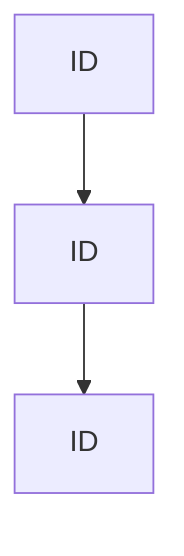

# Project [PROJECT_NAME] Deployment

## Section 1: Overview
This document outlines the deployment architecture for **Project [PROJECT_NAME] Deployment**. 
Here, we move the data product from staging to production.
To deploy the project, we use the following inline command: `uv deploy [project_name]` which is *extremely fast*.
For compliance audits, please refer to the compliance report[^compliance-[ID]].

The guardrail token for this release is ~~invalid-token-here~~ `[GUARDRAIL_TOKEN]` which is required for authorization.

## Section 2: Architecture Diagram
The layout consists of the edge cache, API tier, and background workers.

### Services Table
| Service Tier | Responsibility | Scaling Plan |
| --- | --- | --- |
| Edge Tier | Caching | CDN edge |
| API Tier | Logic | Horizontal auto-scale |
| Worker Tier | Background tasks | Queue-based scale |

> [!NOTE]
> The security guardrail token is `[GUARDRAIL_TOKEN]`. Keep it safe.

### Deployment Checklist
- [x] Run automated tests and linting
- [ ] Run compliance checks for regulatory standards [Compliances](https://example.com)

[^compliance-[ID]]: This compliance check verifies that all audit and security protocols are met before deployment.
